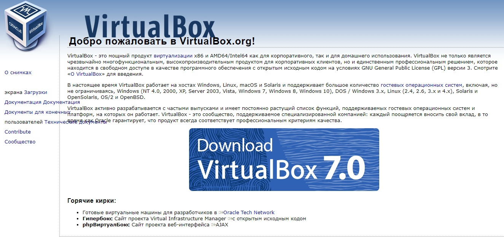
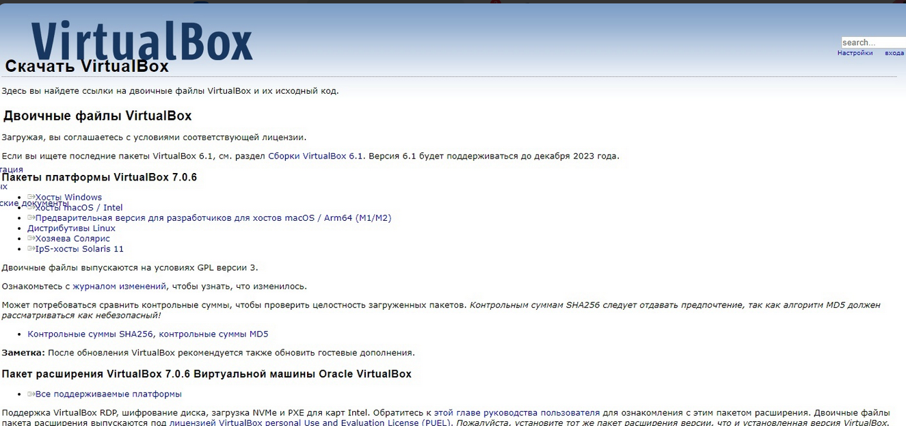
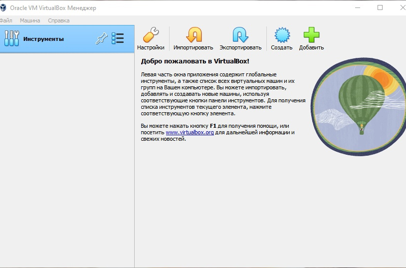
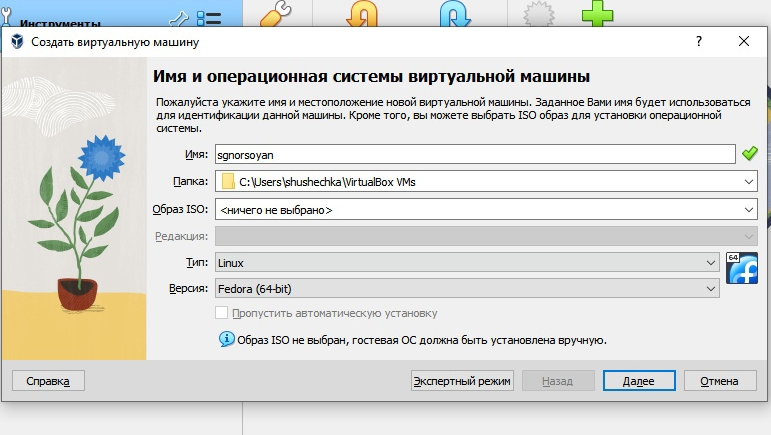
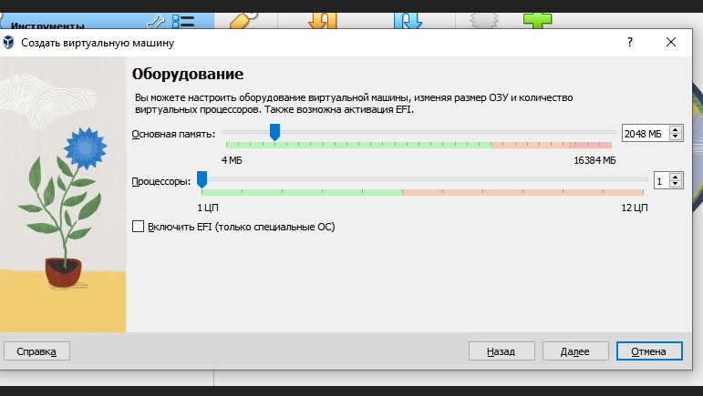
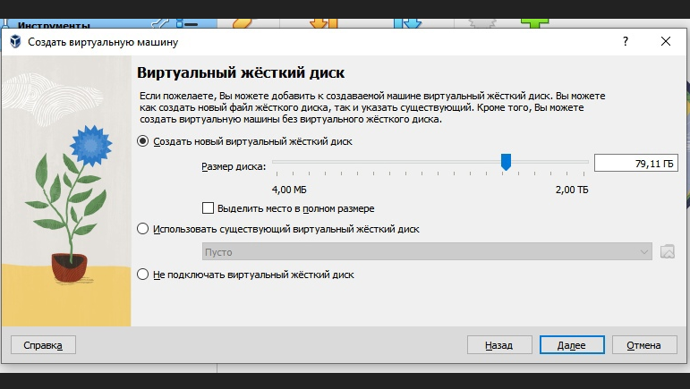
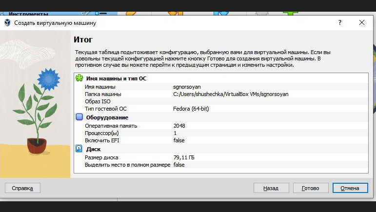
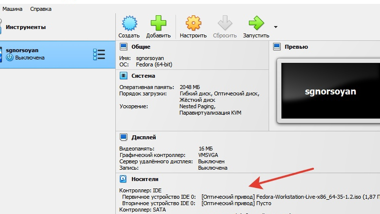

---
## Front matter
lang: ru-RU
title: Лаборатрная рабта №2
subtitle: Простейший шаблон
author:
  - Норсоян Шушаник
institute:
  - Российский университет дружбы народов, Москва, Россия
date: 17 февраля 2023

## i18n babel
babel-lang: russian
babel-otherlangs: english

## Formatting pdf
toc: false
toc-title: Содержание
slide_level: 2
aspectratio: 169
section-titles: true
theme: metropolis
header-includes:
 - \metroset{progressbar=frametitle,sectionpage=progressbar,numbering=fraction}
 - '\makeatletter'
 - '\beamer@ignorenonframefalse'
 - '\makeatother'
---

# Информация

## Докладчик

:::::::::::::: {.columns align=center}
::: {.column width="70%"}

  * Норсоян Шушаник Гагиковна
  * студентка группы НБИбд-02-22
  * Российский университет дружбы народов


:::
::::::::::::::

# Вводная часть

## Актуальность

Лабораторная работа актуальна для тех, кто желаем освоить GitHub.

## Объект и предмет исследования

- Презентация как текст
- Программное обеспечение для создания презентаций
- Входные и выходные форматы презентаций

## Цели и задачи

- Целью данной работы является приобретение практических навыков установки операционной системы на виртуальную машину, настройки минимально необходимых для дальнейшей работы сервисов.

## Материалы и методы

- Процессор `pandoc` для входного формата Markdown
- Результирующие форматы
	- `pdf`
	- `html`
- Автоматизация процесса создания: `Makefile`

# Создание презентации

## Процессор `pandoc`

- Pandoc: преобразователь текстовых файлов
- Сайт: <https://pandoc.org/>
- Репозиторий: <https://github.com/jgm/pandoc>

## Формат `pdf`

- Использование LaTeX
- Пакет для презентации: [beamer](https://ctan.org/pkg/beamer)
- Тема оформления: `metropolis`

## Код для формата `pdf`

```yaml
slide_level: 2
aspectratio: 169
section-titles: true
theme: metropolis
```

## Формат `html`

- Используется фреймворк [reveal.js](https://revealjs.com/)
- Используется [тема](https://revealjs.com/themes/) `beige`

## Код для формата `html`

- Тема задаётся в файле `Makefile`

```make
REVEALJS_THEME = beige 
```
# Результаты

## Получающиеся форматы

- Полученный `pdf`-файл можно демонстрировать в любой программе просмотра `pdf`
- Полученный `html`-файл содержит в себе все ресурсы: изображения, css, скрипты
.

## Содержание исследования

1. 1. Я настроила и создала приложение для установки системы. (рис. [-@fig:001]) 

{#fig:001 width=90%}

{#fig:002 width=90%}

{#fig:003 width=90%}

{#fig:004 width=90%}

{#fig:005 width=90%}

{#fig:006 width=90%}

{#fig:007 width=90%}

{#fig:008 width=90%}

##

2. Я запустила виртуальную машину, установила её на диск и запустила приложения для установки, установила ПО, pandoc, texlife, имя пользователя и хоста (рис. [-@fig:003]) 

{#fig:003 width=90%}

{#fig:004 width=90%}

{#fig:005 width=90%}

{#fig:006 width=90%}

{#fig:007 width=90%}

{#fig:007 width=90%}

##

3. Я установила TEX (рис. [-@fig:005]) 

{#fig:005 width=90%}

{#fig:006 width=90%}

{#fig:007 width=90%}

# Домашнее задание

- Открываю терминал и ввожу все необходимые команды-

- Получите следующую информацию

1. Версия ядра Linux (Linux version).

2. Частота процессора (Detected Mhz processor).

3. Модель процессора (CPU0).

4. Объем доступной оперативной памяти (Memory available).

5. Тип обнаруженного гипервизора (Hypervisor detected).

6. Тип файловой системы корневого раздела.(filesystem)

7. Последовательность монтирования файловых систем.(mount).

# Контрольные вопросы

1. Какую информацию содержит учётная запись пользователя? 

2. Укажите команды терминала и приведите примеры: – для получения справки по команде; – для перемещения по файловой системе; – для просмотра содержимого каталога; – для определения объёма каталога; – для создания / удаления каталогов / файлов; – для задания определённых прав на файл / каталог; – для просмотра истории команд. 

3. Что такое файловая система? Приведите примеры с краткой характеристикой. 

4. Как посмотреть, какие файловые системы подмонтированы в ОС? 

5. Как удалить зависший процесс?


1. имя и пароль

2. info mv ls du Mkdir Chmod History

3. Файловая система- это часть операционной системы, суть которой состоит в том, чтобы обеспечить пользователю удобный интерфейс при работе с данными, хранящимися на диске, и обеспечить совместное использование файлов несколькими пользователями и процессами. информация о разрешенном доступе,пароль для доступа к файлу, владелец файла, создатель файла, признак "только для чтения", признак "скрытый файл", признак "системный файл", признак "архивный файл", признак "двоичный/символьный", признак "временный" (удалить после завершения процесса), признак блокировки, длина записи, указатель на ключевое поле в записи,длина ключа, времена создания, последнего доступа и последнего изменения,текущий размер файла,максимальный размер файла.
 
4. Делается это при помощи команды mount 

5. Команда kill

# Выводы

Я приобрел практических навыков установки операционной системы на виртуальную машину, настройки минимально необходимых для дальнейшей работы сервисов.

## Результаты

- Настроили GitHub 
- Создали ключи

## Итоговый слайд

- В ходе выполнения лабораторной работы, мы изучили идеологию и применение средств контроля версий и освоили умения работать с git.


