---
## Front matter
title: "Отчёт по лабораторной работе №5"
subtitle: "Архитектура вычислительных систем"
author: "Норсоян Шушаник Гагиковна"

## Generic otions
lang: ru-RU
toc-title: "Содержание"

## Bibliography
bibliography: bib/cite.bib
csl: pandoc/csl/gost-r-7-0-5-2008-numeric.csl

## Pdf output format
toc: true # Table of contents
toc-depth: 2
lof: true # List of figures
lot: true # List of tables
fontsize: 12pt
linestretch: 1.5
papersize: a4
documentclass: scrreprt
## I18n polyglossia
polyglossia-lang:
name: russian
options:
- spelling=modern
- babelshorthands=true
polyglossia-otherlangs:
name: english
## I18n babel
babel-lang: russian
babel-otherlangs: english
## Fonts
mainfont: PT Serif
romanfont: PT Serif
sansfont: PT Sans
monofont: PT Mono
mainfontoptions: Ligatures=TeX
romanfontoptions: Ligatures=TeX
sansfontoptions: Ligatures=TeX,Scale=MatchLowercase
monofontoptions: Scale=MatchLowercase,Scale=0.9
## Biblatex
biblatex: true
biblio-style: "gost-numeric"
biblatexoptions:
- parentracker=true
- backend=biber
- hyperref=auto
- language=auto
- autolang=other*
- citestyle=gost-numeric
## Pandoc-crossref LaTeX customization
figureTitle: "Рис."
tableTitle: "Таблица"
listingTitle: "Листинг"
lofTitle: "Список иллюстраций"
lotTitle: "Список таблиц"
lolTitle: "Листинги"
## Misc options
indent: true
header-includes:
- \usepackage{indentfirst}
- \usepackage{float} # keep figures where there are in the text
- \floatplacement{figure}{H} # keep figures where there are in the text
---

# Цель работы

Целью данной работы является приобретение практических навыков установки операционной системы на виртуальную машину, настройки минимально необходимых для дальнейшей работы сервисов.

# Теоретическое введение

# Выполнение лабораторной работы

1. Я настроила и создала приложение для установки системы

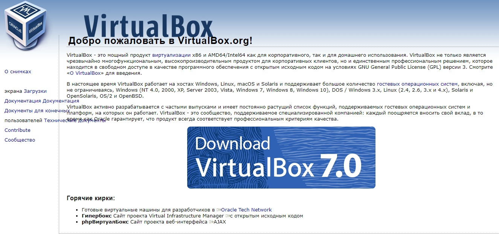{ #fig:001 width=90% }

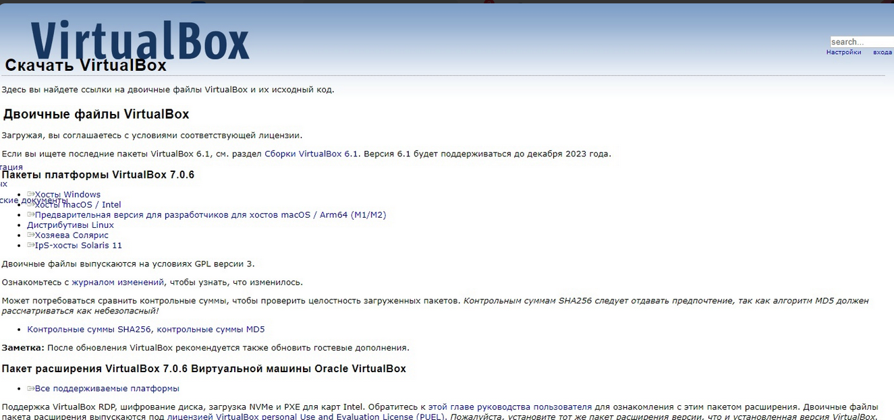{ #fig:002 width=90% }

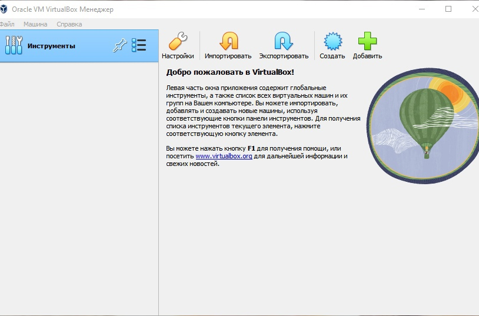{ #fig:003 width=90% }

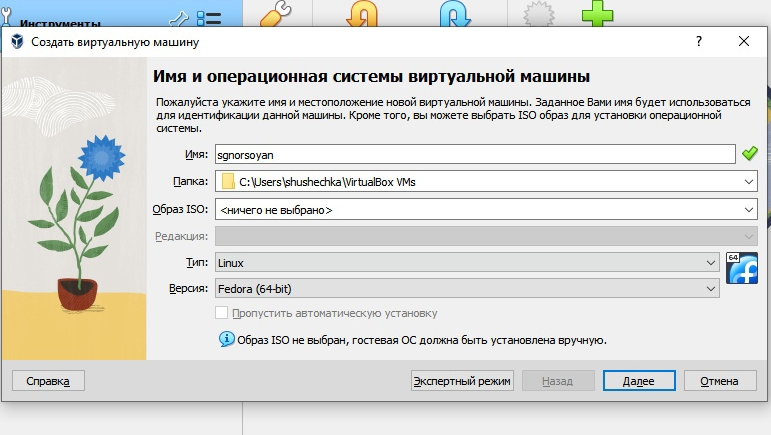{ #fig:004 width=90% }

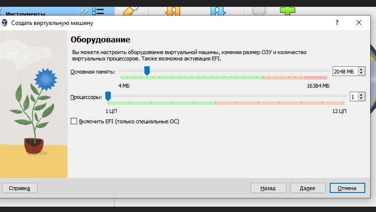{ #fig:005 width=90% }

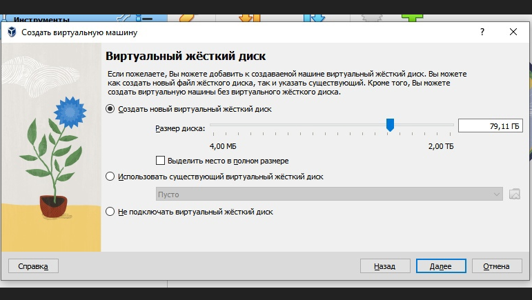{ #fig:006 width=90% }

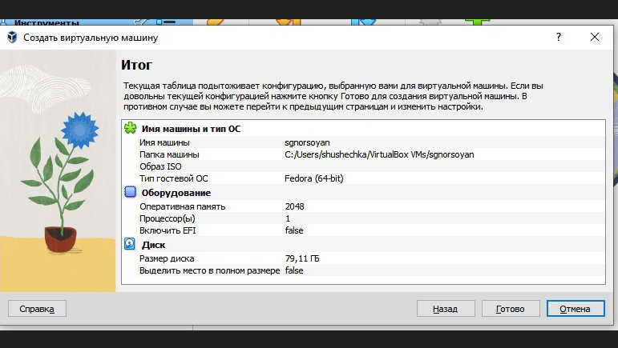{ #fig:007 width=90% }

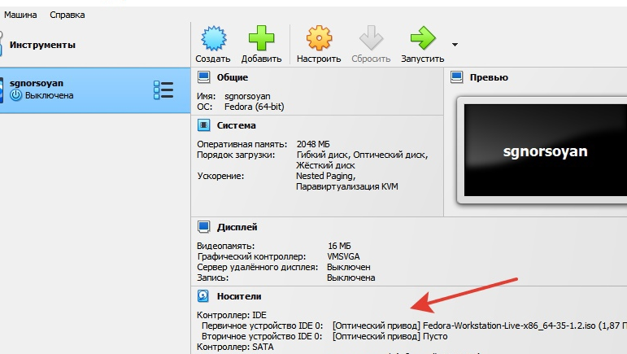{ #fig:008 width=90% }

2. Я запустила виртуальную машину, установила её на диск и запустила приложения для установки, установила ПО, pandoc, texlife, имя пользователя и хоста

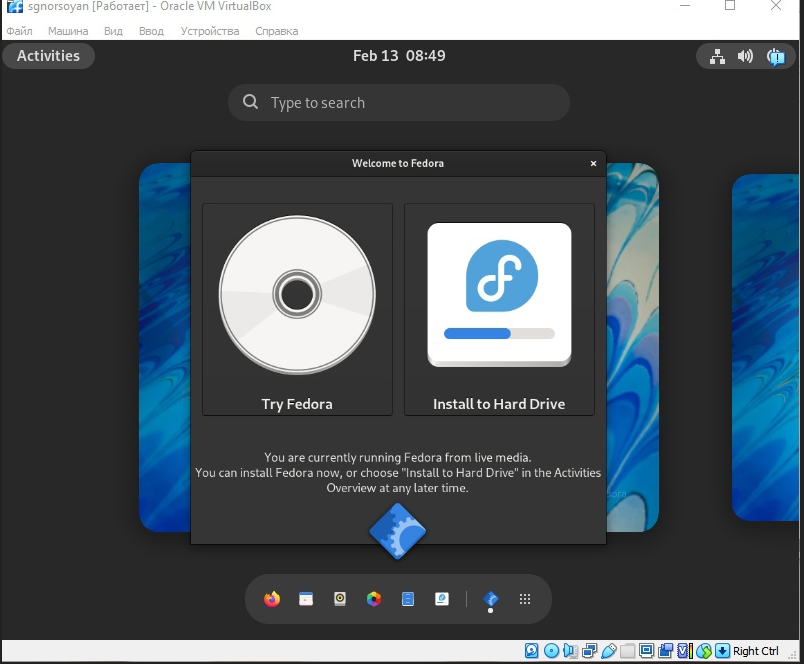{ #fig:009 width=90% }

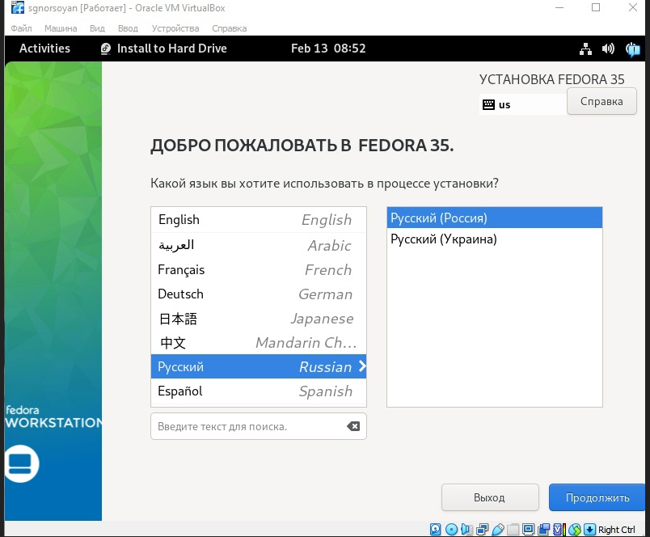{ #fig:010 width=90% }

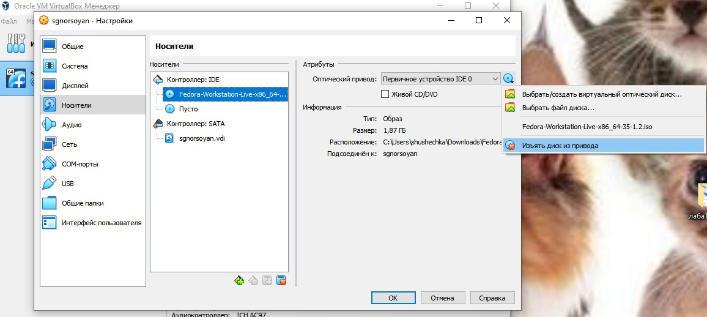{ #fig:011 width=90% }

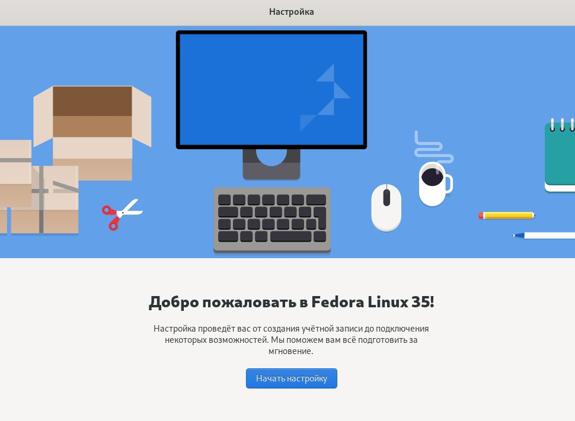{ #fig:012 width=90% }

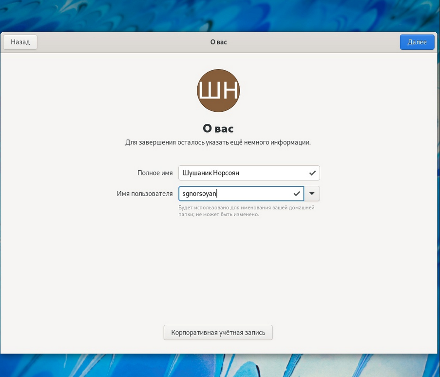{ #fig:013 width=90% }

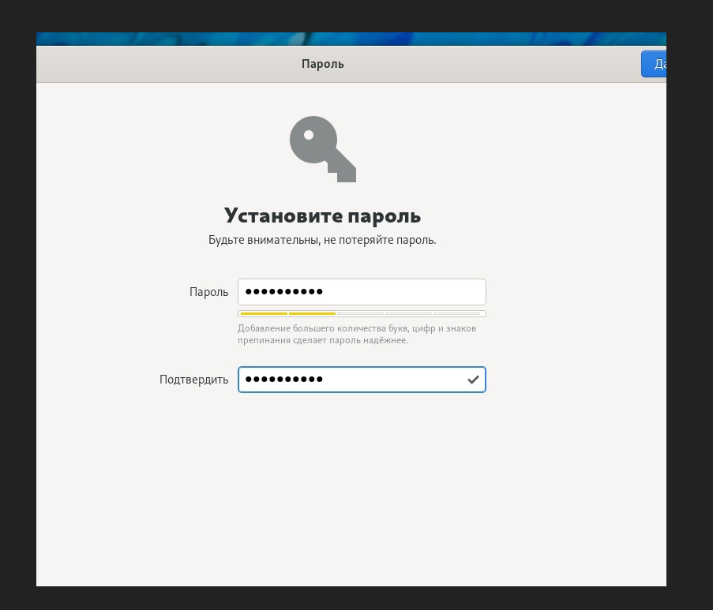{ #fig:014 width=90% }

3. Я установила TEX

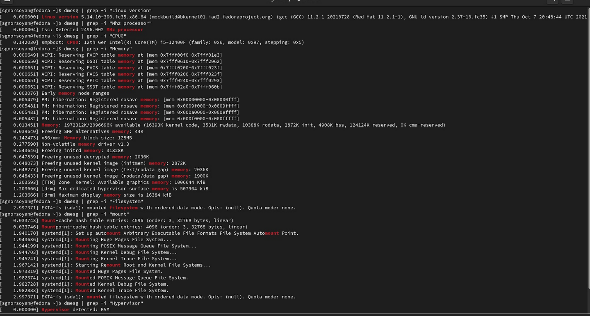{ #fig:015 width=90% }

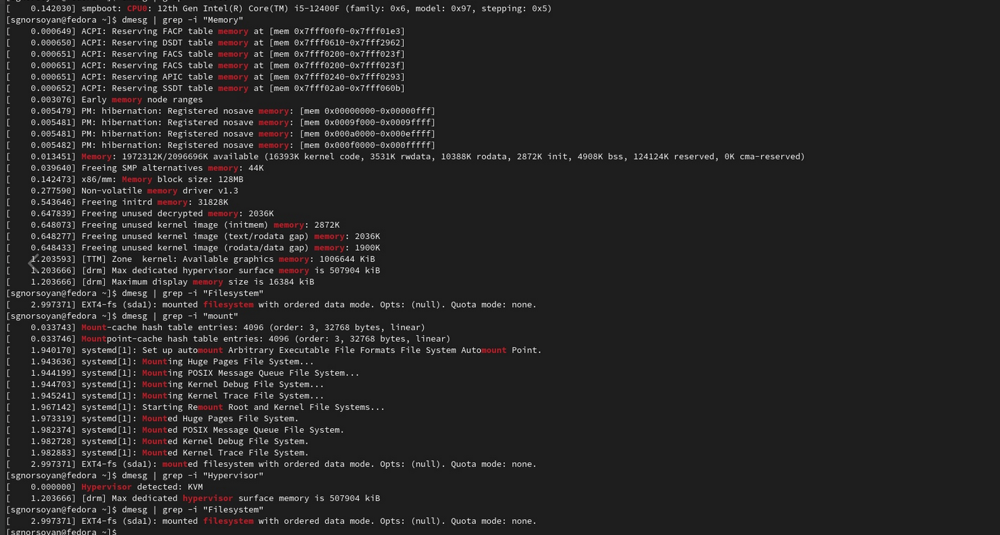{ #fig:016 width=90% }

# Домашнее задание

Открываю терминал и ввожу все необходимые команды-
Получите следующую информацию
1. Версия ядра Linux (Linux version).
2. Частота процессора (Detected Mhz processor).
3. Модель процессора (CPU0).
4. Объем доступной оперативной памяти (Memory available).
5. Тип обнаруженного гипервизора (Hypervisor detected).
6. Тип файловой системы корневого раздела.(filesystem)
7. Последовательность монтирования файловых систем.(mount).

# Контрольные вопросы

1. Какую информацию содержит учётная запись пользователя? 
2. Укажите команды терминала и приведите примеры: – для получения справки по команде; – для перемещения по файловой системе; – для просмотра содержимого каталога; – для определения объёма каталога; – для создания / удаления каталогов / файлов; – для задания определённых прав на файл / каталог; – для просмотра истории команд. 
3. Что такое файловая система? Приведите примеры с краткой характеристикой. 
4. Как посмотреть, какие файловые системы подмонтированы в ОС? 
5. Как удалить зависший процесс?

1. имя и пароль

2. info
mv
ls
du
Mkdir
Chmod
History

3. Файловая система- это часть операционной системы, суть которой состоит в том, чтобы обеспечить пользователю удобный интерфейс при работе с данными, хранящимися на диске, и обеспечить совместное использование файлов несколькими пользователями и процессами.
информация о разрешенном доступе,
пароль для доступа к файлу,
владелец файла,
создатель файла,
признак "только для чтения",
признак "скрытый файл",
признак "системный файл",
признак "архивный файл",
признак "двоичный/символьный",
признак "временный" (удалить после завершения процесса),
признак блокировки,
длина записи,
указатель на ключевое поле в записи,
длина ключа,
времена создания, последнего доступа и последнего изменения,
текущий размер файла,
максимальный размер файла. 
4. Делается это при помощи команды mount 

5. Команда kill

# Выводы

Мы приобрели практические навыкови работы в Midnight Commander. И освоили иструкции языка ассемблера mov и int.

# Список литературы{.unnumbered}

::: {#refs}
:::
