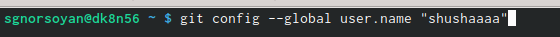
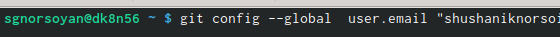
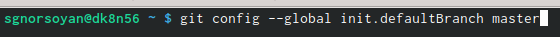
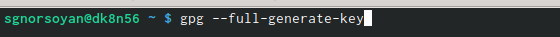
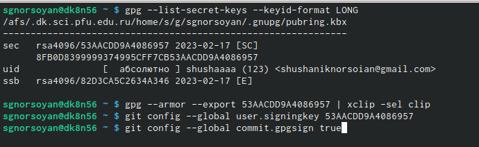
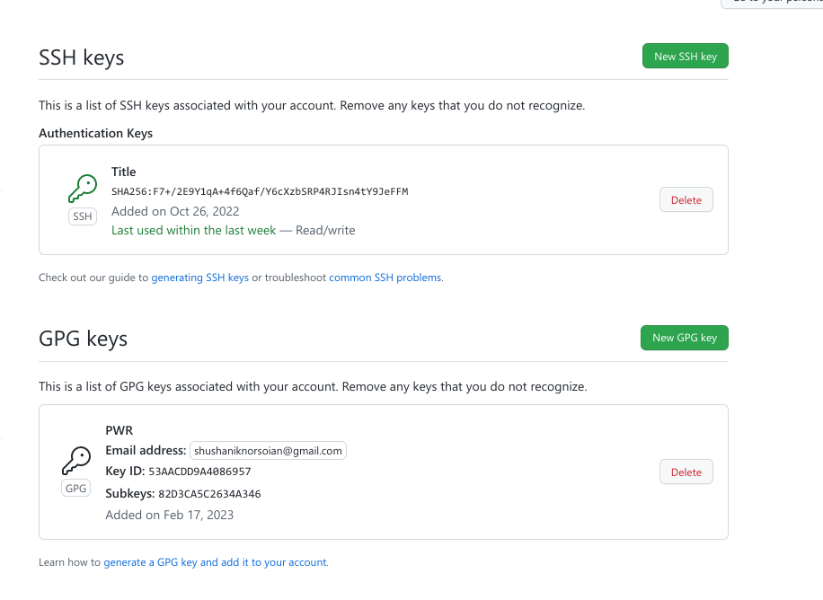
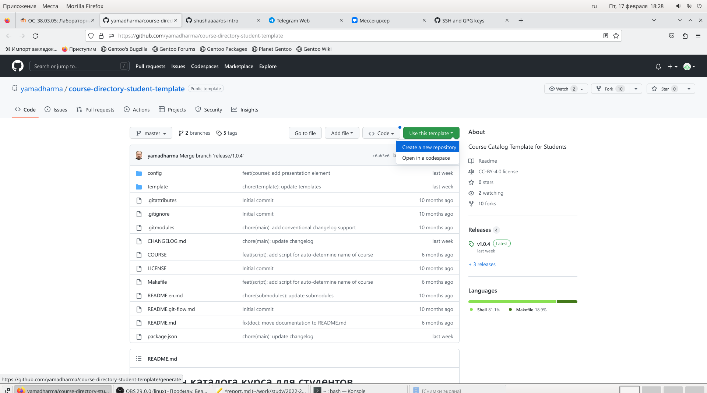
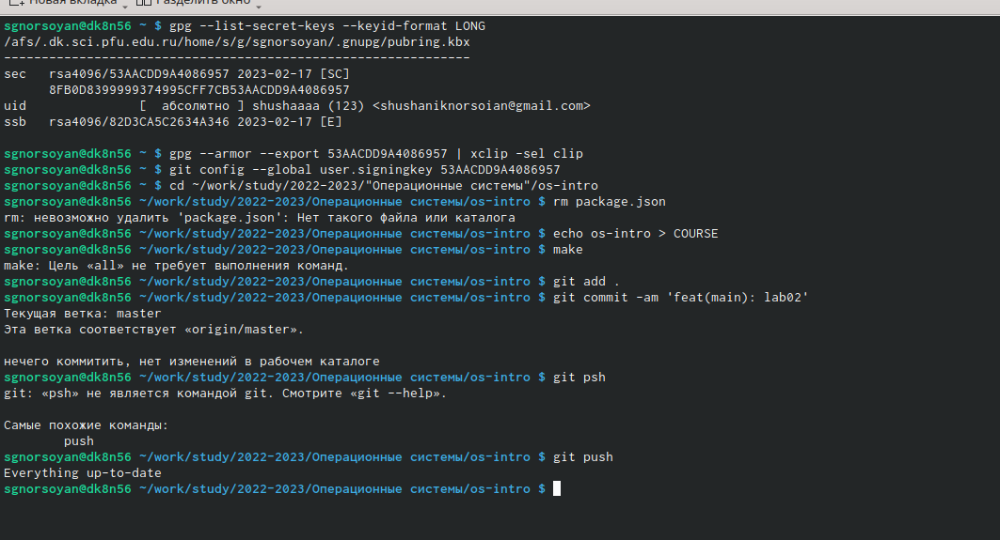

---
## Front matter
title: "Отчёт по лабораторной работе №2"
subtitle: "Операционные системы"
author: "Норсоян Шушаник Гагиковна"

## Generic otions
lang: ru-RU
toc-title: "Содержание"

## Bibliography
bibliography: bib/cite.bib
csl: pandoc/csl/gost-r-7-0-5-2008-numeric.csl

## Pdf output format
toc: true # Table of contents
toc-depth: 2
lof: true # List of figures
lot: true # List of tables
fontsize: 12pt
linestretch: 1.5
papersize: a4
documentclass: scrreprt
## I18n polyglossia
polyglossia-lang:
name: russian
options:
- spelling=modern
- babelshorthands=true
polyglossia-otherlangs:
name: english
## I18n babel
babel-lang: russian
babel-otherlangs: english
## Fonts
mainfont: PT Serif
romanfont: PT Serif
sansfont: PT Sans
monofont: PT Mono
mainfontoptions: Ligatures=TeX
romanfontoptions: Ligatures=TeX
sansfontoptions: Ligatures=TeX,Scale=MatchLowercase
monofontoptions: Scale=MatchLowercase,Scale=0.9
## Biblatex
biblatex: true
biblio-style: "gost-numeric"
biblatexoptions:
- parentracker=true
- backend=biber
- hyperref=auto
- language=auto
- autolang=other*
- citestyle=gost-numeric
## Pandoc-crossref LaTeX customization
figureTitle: "Рис."
tableTitle: "Таблица"
listingTitle: "Листинг"
lofTitle: "Список иллюстраций"
lotTitle: "Список таблиц"
lolTitle: "Листинги"
## Misc options
indent: true
header-includes:
- \usepackage{indentfirst}
- \usepackage{float} # keep figures where there are in the text
- \floatplacement{figure}{H} # keep figures where there are in the text
---

# Цель работы

Изучить идеологию и применение средств контроля версий.
Освоить умения по работе с git.

# Выполнение лабораторной работы

1. Я выполнила базовую настройку git

{ #fig:001 width=90% }

{ #fig:002 width=90% }

2. Я настроила вывод git

{ #fig:003 width=90% }

{ #fig:004 width=90% }

3. Я создала и сделала pgp ключ. SSH был настроен в прошлой лаболаторной

{ #fig:005 width=90% }

{ #fig:006 width=90% }

{ #fig:007 width=90% }

4. Я создала репозиторий для работы.

{ #fig:008 width=90% }

{ #fig:009 width=90% }

5. Я прокоммитила и отправила файлы на гитхаб

{ #fig:010 width=90% }

{ #fig:011 width=90% }

# Выводы

Мы приобрели практические навыкови работы в github

# Список литературы{.unnumbered}

::: {#refs}
:::
