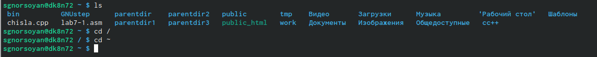
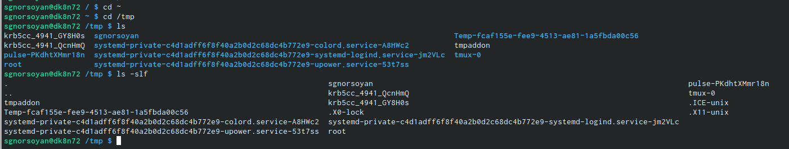
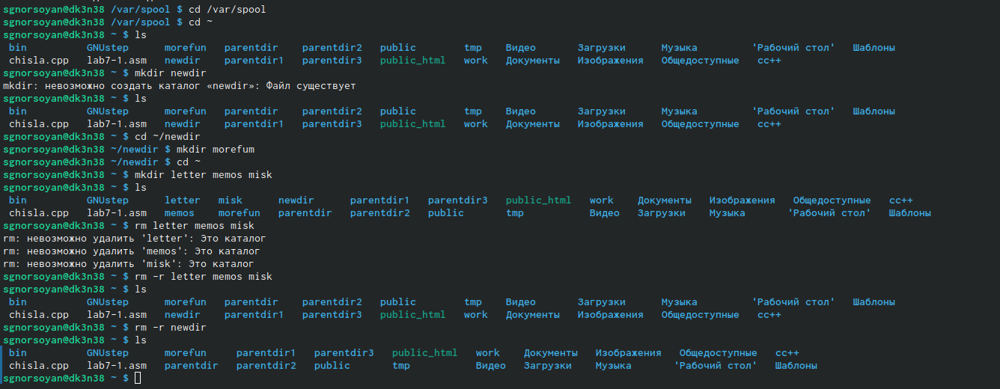
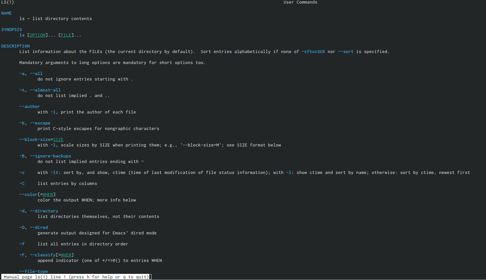
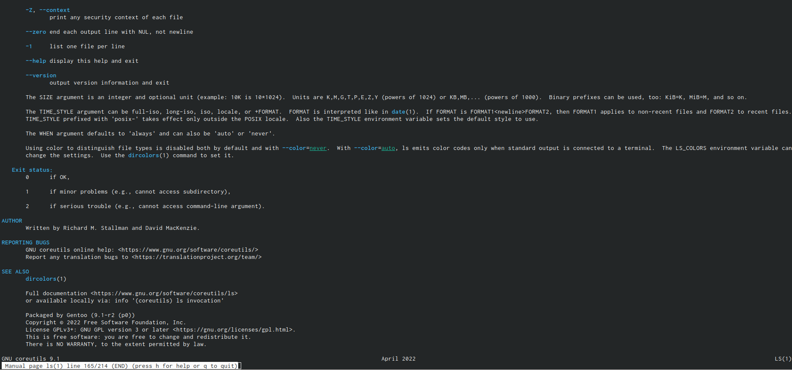
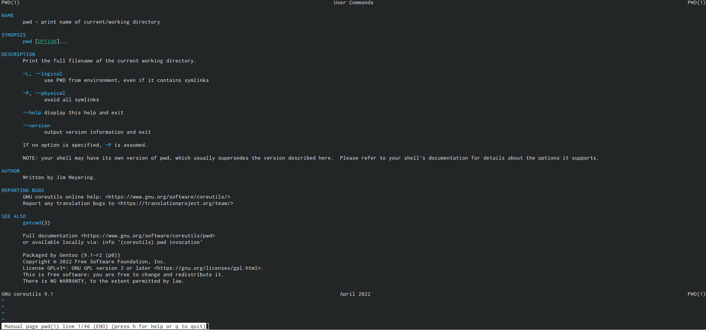
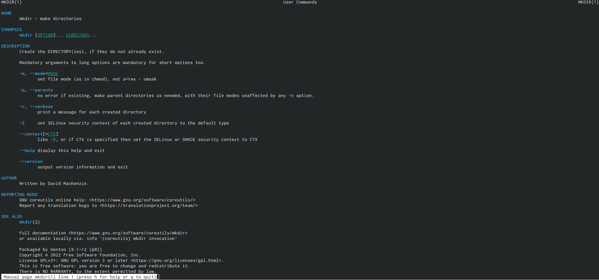
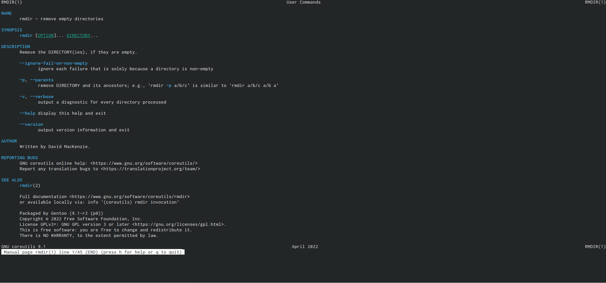
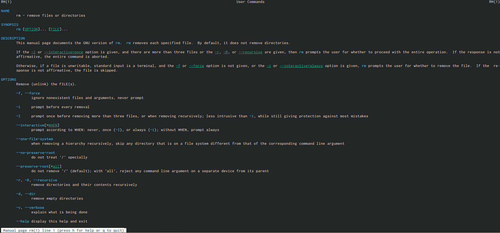
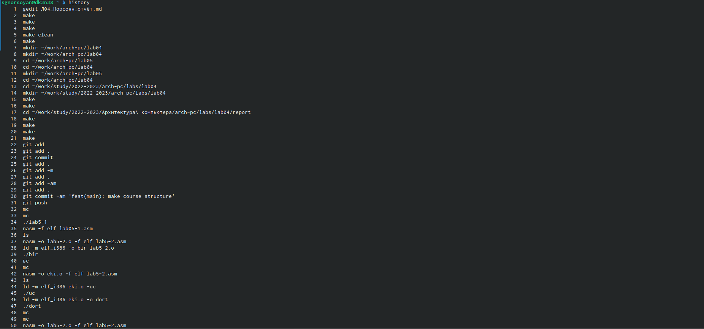

---
## Front matter
lang: ru-RU
title: Лаборатрная рабта №4
subtitle: Основы интерфейса взаимодействия пользователя с системой Unix на уровне командной строки
author:
  - Норсоян Шушаник Гагиковна
institute:
  - Российский университет дружбы народов, Москва, Россия
date: 1 марта 2023

## i18n babel
babel-lang: russian
babel-otherlangs: english

## Formatting pdf
toc: false
toc-title: Содержание
slide_level: 2
aspectratio: 169
section-titles: true
theme: metropolis
header-includes:
 - \metroset{progressbar=frametitle,sectionpage=progressbar,numbering=fraction}
 - '\makeatletter'
 - '\beamer@ignorenonframefalse'
 - '\makeatother'
---

# Информация

## Докладчик

:::::::::::::: {.columns align=center}
::: {.column width="70%"}

  * Норсоян Шушаник Гагиковна
  * студентка группы НБИбд-02-22
  * Российский университет дружбы народов

:::
::: {.column width="30%"}

:::
::::::::::::::

## Цели и задачи

- Приобретение практических навыков взаимодействия пользователя с системой посредством командной строки.

## Выполнение лабораторной работы

1. Определяю полное имя домашнего каталога и перехожу в каталог /tmp и вывожу его содержимое двумя способами

{#fig:001 width=90%}

{#fig:002 width=90%}

##

2. Определяю, есть ли в каталоге /var/spool подкаталог с именем cron и перехожу в домашний каталог и вывожу содержимое и определяю кто владелец далее в домашнем каталоге создаю новый каталог newdir, а в нём новый каталог morefun. Далее создаю одной командой три новых каталога letters,memos,misk и удалю одной командой

{#fig:003 width=90%}

##

3. С помощью команды man определяю опции команды ls, cd, pwd, mkdir, rmdir, rm. Разница в выводимой на экран информации: Команда ls выводит содержимое каталога. Команда ls -l выводит подробный список, в котором будет отображаться владелец, группа, дата создания, размер и другие параметры. Команда lsF показывает тип объекта.

##

4. команды man 

{#fig:004 width=90%}

{#fig:005 width=90%}

{#fig:006 width=90%}

{#fig:007 width=90%}

{#fig:008 width=90%}

{#fig:009 width=90%}

{#fig:010 width=90%}

##

5. Основные опции этих команд: 
cd – команда перемещения по файловой системе. 
pwd – команда показывающая директорию, в которой находится пользователь.
mkdir – команда, создающая новую директорию. rmdir – команда, удаляющая файлы, которые должны быть пустыми. rm - команда, удаляющая файлы или целые деревья каталогов.
Используя информацию, полученную при помощи команды history, выполнила модификацию и исполнение нескольких команд из буфера команд. Команда
histor

{#fig:011 width=90%}

## Результаты

Мы приобрели практические навыки взаимодействия пользователя с системой посредством командной строки

