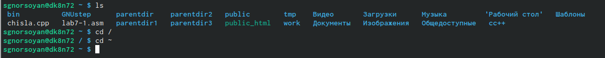
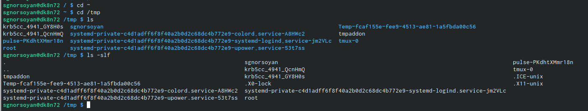
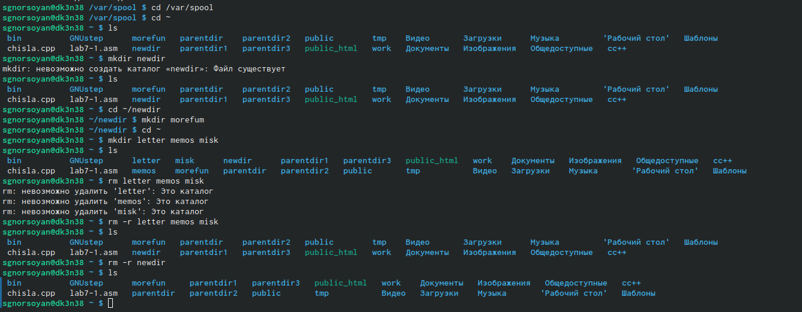
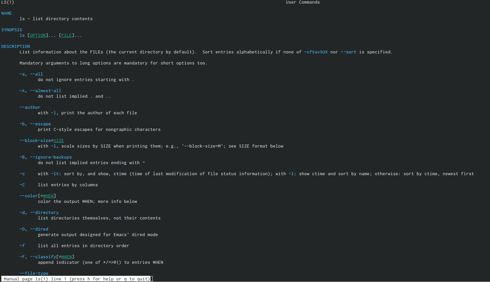
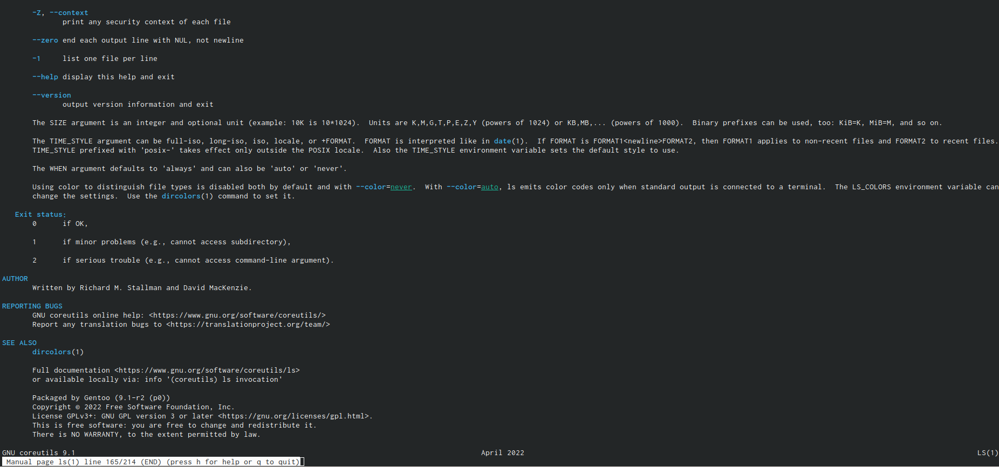
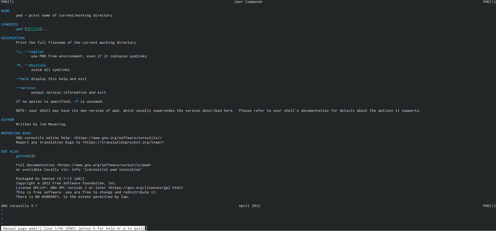
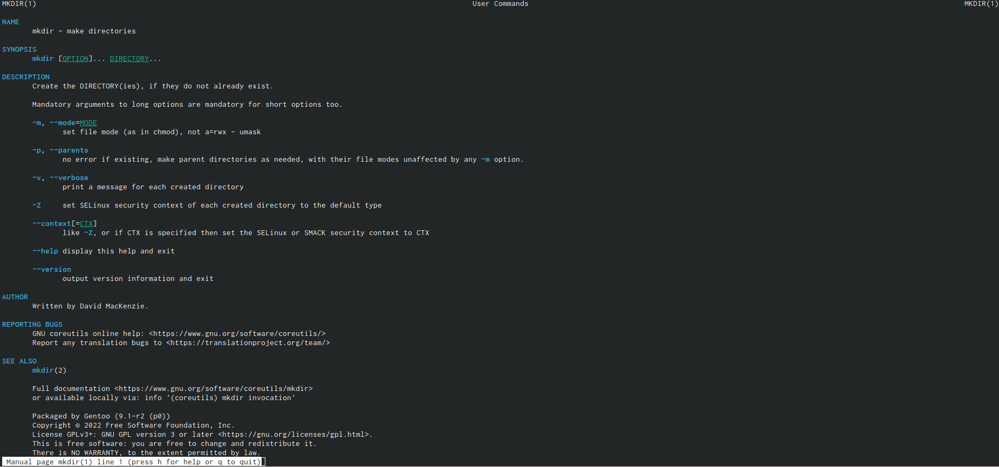
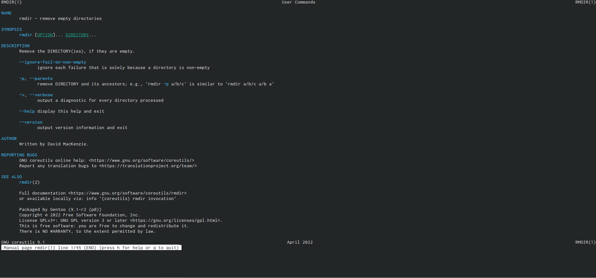
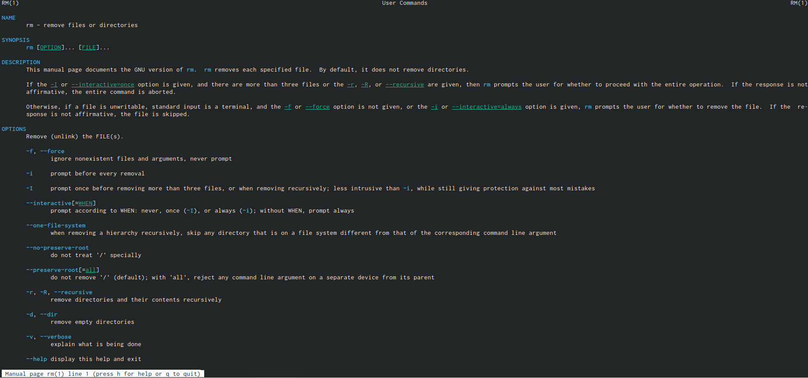
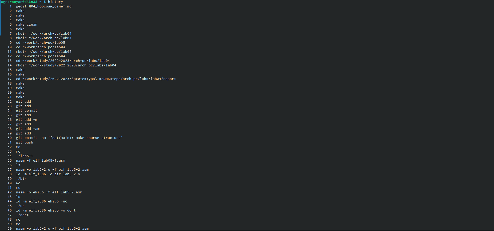

---
## Front matter
title: "Лабораторная работа №4"
subtitle: "Основы интерфейса взаимодействия пользователя с системой Unix на уровне командной строки"
author: "Норсоян Шушаник Гагиковна"

## Generic otions
lang: ru-RU
toc-title: "Содержание"

## Bibliography
bibliography: bib/cite.bib
csl: pandoc/csl/gost-r-7-0-5-2008-numeric.csl

## Pdf output format
toc: true # Table of contents
toc-depth: 2
lof: true # List of figures
lot: true # List of tables
fontsize: 12pt
linestretch: 1.5
papersize: a4
documentclass: scrreprt
## I18n polyglossia
polyglossia-lang:
  name: russian
  options:
	- spelling=modern
	- babelshorthands=true
polyglossia-otherlangs:
  name: english
## I18n babel
babel-lang: russian
babel-otherlangs: english
## Fonts
mainfont: PT Serif
romanfont: PT Serif
sansfont: PT Sans
monofont: PT Mono
mainfontoptions: Ligatures=TeX
romanfontoptions: Ligatures=TeX
sansfontoptions: Ligatures=TeX,Scale=MatchLowercase
monofontoptions: Scale=MatchLowercase,Scale=0.9
## Biblatex
biblatex: true
biblio-style: "gost-numeric"
biblatexoptions:
  - parentracker=true
  - backend=biber
  - hyperref=auto
  - language=auto
  - autolang=other*
  - citestyle=gost-numeric
## Pandoc-crossref LaTeX customization
figureTitle: "Рис."
tableTitle: "Таблица"
listingTitle: "Листинг"
lofTitle: "Список иллюстраций"
lotTitle: "Список таблиц"
lolTitle: "Листинги"
## Misc options
indent: true
header-includes:
  - \usepackage{indentfirst}
  - \usepackage{float} # keep figures where there are in the text
  - \floatplacement{figure}{H} # keep figures where there are in the text
---

# Цель работы

Приобретение практических навыков взаимодействия пользователя с системой по-
средством командной строки

# Задание

1. Определите полное имя вашего домашнего каталога. Далее относительно этого ката-
лога будут выполняться последующие упражнения.
2. Выполните следующие действия:
2.1. Перейдите в каталог /tmp.
2.2. Выведите на экран содержимое каталога /tmp. Для этого используйте команду ls
с различными опциями. Поясните разницу в выводимой на экран информации.
2.3. Определите, есть ли в каталоге /var/spool подкаталог с именем cron?
2.4. Перейдите в Ваш домашний каталог и выведите на экран его содержимое. Опре-
делите, кто является владельцем файлов и подкаталогов?
3. Выполните следующие действия:
3.1. В домашнем каталоге создайте новый каталог с именем newdir.
3.2. В каталоге ~/newdir создайте новый каталог с именем morefun.
3.3. В домашнем каталоге создайте одной командой три новых каталога с именами
letters, memos, misk. Затем удалите эти каталоги одной командой.
3.4. Попробуйте удалить ранее созданный каталог ~/newdir командой rm. Проверьте,
был ли каталог удалён.
3.5. Удалите каталог ~/newdir/morefun из домашнего каталога. Проверьте, был ли
каталог удалён.
4. С помощью команды man определите, какую опцию команды ls нужно использо-
вать для просмотра содержимое не только указанного каталога, но и подкаталогов,
входящих в него.
5. С помощью команды man определите набор опций команды ls, позволяющий отсорти-
ровать по времени последнего изменения выводимый список содержимого каталога
с развёрнутым описанием файлов.
6. Используйте команду man для просмотра описания следующих команд: cd, pwd, mkdir,
rmdir, rm. Поясните основные опции этих команд.
7. Используя информацию, полученную при помощи команды history, выполните мо-
дификацию и исполнение нескольких команд из буфера команд.

# Теоретическое введение

Здесь описываются теоретические аспекты, связанные с выполнением работы.

Например, в табл. @tbl:std-dir приведено краткое описание стандартных каталогов Unix.

: Описание некоторых каталогов файловой системы GNU Linux {#tbl:std-dir}

| Имя каталога | Описание каталога                                                                                                          |
|--------------|----------------------------------------------------------------------------------------------------------------------------|
| `/`          | Корневая директория, содержащая всю файловую                                                                               |
| `/bin `      | Основные системные утилиты, необходимые как в однопользовательском режиме, так и при обычной работе всем пользователям     |
| `/etc`       | Общесистемные конфигурационные файлы и файлы конфигурации установленных программ                                           |
| `/home`      | Содержит домашние директории пользователей, которые, в свою очередь, содержат персональные настройки и данные пользователя |
| `/media`     | Точки монтирования для сменных носителей                                                                                   |
| `/root`      | Домашняя директория пользователя  `root`                                                                                   |
| `/tmp`       | Временные файлы                                                                                                            |
| `/usr`       | Вторичная иерархия для данных пользователя                                                                                 |

Более подробно об Unix см. в [@gnu-doc:bash;@newham:2005:bash;@zarrelli:2017:bash;@robbins:2013:bash;@tannenbaum:arch-pc:ru;@tannenbaum:modern-os:ru].

# Выполнение лабораторной работы

1. Определяю полное имя домашнего каталога и перехожу в каталог /tmp и вывожу его содержимое двумя способами

{#fig:001 width=90%}

{#fig:002 width=90%}

2. Определяю, есть ли в каталоге /var/spool подкаталог с именем cron и перехожу в домашний каталог и вывожу содержимое и определяю кто владелец далее в домашнем каталоге создаю новый каталог newdir, а в нём новый каталог morefun. Далее создаю одной командой три новых каталога letters,memos,misk и удалю одной командой

{#fig:003 width=90%}

3. С помощью команды man определяю опции команды ls, cd, pwd, mkdir, rmdir, rm. Разница в выводимой на экран информации: Команда ls выводит содержимое каталога. Команда ls -l выводит подробный список, в котором будет отображаться владелец, группа, дата создания, размер и другие параметры. Команда lsF показывает тип объекта.

4. команды man 

{#fig:004 width=90%}

{#fig:005 width=90%}

{#fig:006 width=90%}

{#fig:007 width=90%}

{#fig:008 width=90%}

{#fig:009 width=90%}

{#fig:010 width=90%}

5. Основные опции этих команд: 
cd – команда перемещения по файловой системе. 
pwd – команда показывающая директорию, в которой находится пользователь.
mkdir – команда, создающая новую директорию. rmdir – команда, удаляющая файлы, которые должны быть пустыми. rm - команда, удаляющая файлы или целые деревья каталогов.
Используя информацию, полученную при помощи команды history, выполнила модификацию и исполнение нескольких команд из буфера команд. Команда
histor

{#fig:011 width=90%}

# Выводы

Мы приобрели практические навыки взаимодействия пользователя с системой посредством командной строки.

#Контрольные вопросы

1. Что такое командная строка?
2. При помощи какой команды можно определить абсолютный путь текущего каталога?
Приведите пример.
3. При помощи какой команды и каких опций можно определить только тип файлов
и их имена в текущем каталоге? Приведите примеры.
4. Каким образом отобразить информацию о скрытых файлах? Приведите примеры.
5. При помощи каких команд можно удалить файл и каталог? Можно ли это сделать
одной и той же командой? Приведите примеры.
6. Каким образом можно вывести информацию о последних выполненных пользовате-
лем командах? работы?
7. Как воспользоваться историей команд для их модифицированного выполнения? При-
ведите примеры.
8. Приведите примеры запуска нескольких команд в одной строке.
9. Дайте определение и приведите примера символов экранирования.
10. Охарактеризуйте вывод информации на экран после выполнения команды ls с опцией
11. Что такое относительный путь к файлу? Приведите примеры использования относи-
тельного и абсолютного пути при выполнении какой-либо команды.
12. Как получить информацию об интересующей вас команде?
13. Какая клавиша или комбинация клавиш служит для автоматического дополнения
вводимых команд?

#Ответы на контрольные вопросы

1. Интерфейс командной строки - управление программами с помощью команд.
Команды состоят из букв, цифр, символов, набираются построчно, выполняются
после нажатия клавиши Enter. Основной инструмент здесь клавиатура. Данный
интерфейс встроен в ядро системы, он будет доступен, даже если графический ин-
терфейс не запустится. Добраться до командной строки можно двумя способами:
через консоль или терминал.
2. При помощи команды realpath можно определить абсолютный путь текущего
каталога. Например, если вбить realpath var на экран выведется /home//var.
3. При помощи команды ls -F можно определить только тип файлов и их имена
в текущем каталоге.
4. Файл (или директория) считается скрытым, если его название начинается с
символа точка «.». Например, «.myfile». Обычно такие файлы используются
приложениями для хранения настроек, конфигураций и другой информа-
ции, которую нужно скрыть от пользователя. Зачастую пользователю требу-
ется отредактировать соответствующий конфигурационный скрытый файл,
чтобы настроить какую-нибудь программу, и пользователи сталкиваются с
тем, что не знают, как их вообще просмотреть. По умолчанию файловые
менеджеры обычно не отображают такие файлы. Для просмотра списка
файлов в командной строке используется команда ls. Чтобы по команде ls
также выводились скрытые файлы, существует опция -a.
5. При помощи команд rm и rmdir можно удалить файл и каталог. Это нельзя
20
сделать одной и той же командой. rmdir используется, чтобы удалить файлы,
которые должны быть пустые. rm используется, чтобы удалить непустые
файлы или целые деревья каталогов.
6. Определить какие команды выполнил пользователь в сеансе работы можно
с помощь команды history.
7. Исправить и запустить на выполнение команду, которую пользователь уже
использовал в сеансе работы, можно с помощью команды: !:s// Например,
history . . 3 ls -a . . !3:s/a/F ls -F
8. В одной строке можно записать несколько команд. Если требуется выпол-
нить последовательно несколько команд, записанный в одной строке, то для
этого используется символ точка с запятой. Пример: cd; ls. 9.Экранирование
— это способ заключения в кавычки одиночного символа. Экранирующий
символ () сообщает интерпретатору, что следующий за ним символ должен
восприниматься как обычный символ. Пример: echo “Привет” # Привет
echo “Он сказал: ”Привет”.” # Он сказал: “Привет”.
9. Если используется опция l в команде ls, то на экран выводится подробный
список, в котором будет отображаться владелец, группа, дата создания,
размер и другая информация о файлах и каталогах.
10. Относительный путь – это путь к файлу относительно текущей папки. При
использовании команды pwd на экран выведется относительный путь теку-
щей директории, а при использовании команды realpath на экран выведется
абсолютный путь текущей директории.
11. Получить информацию об интересующей вас команде можно с помощью
команды man. Например, команда man ls выведет все опции команды ls.
12. Сочетание клавиш Ctrl+C прерывает текущий процесс, запущенный в тер-
минале

# Список литературы{.unnumbered}

::: {#refs}
:::
