---
## Front matter
lang: ru-RU
title: Лабораторная рабта №6
subtitle: Арифметические операции в NASM
author:
  - Норсоян Шушаник Гагиковна
institute:
  - Российский университет дружбы народов, Москва, Россия
date: 15 марта 2023

## i18n babel
babel-lang: russian
babel-otherlangs: english

## Formatting pdf
toc: false
toc-title: Содержание
slide_level: 2
aspectratio: 169
section-titles: true
theme: metropolis
header-includes:
 - \metroset{progressbar=frametitle,sectionpage=progressbar,numbering=fraction}
 - '\makeatletter'
 - '\beamer@ignorenonframefalse'
 - '\makeatother'
---

# Информация

## Докладчик

:::::::::::::: {.columns align=center}
::: {.column width="70%"}

  * Норсоян Шушаник Гагиковна
  * студентка группы НБИбд-02-22
  * Российский университет дружбы народов

:::
::: {.column width="30%"}

:::
::::::::::::::

## Цели и задачи

- Освоение арифметических инструкций языка ассемблера NASM

## Выполнение лабораторной работы

1. Вошла в систему, используя свой пароль. Записываю в файл file.txt названия файлов, содержащихся в каталоге /etc. Дописываю в этот же файл названия файлов, содержащихся в домашнем каталоге.

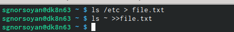{#fig:001 width=90%}

##

2. Вывожу имена всех файлов из file.txt, имеющих расширение .conf, после чего записалf их в новых текстовый файл conf.txt 

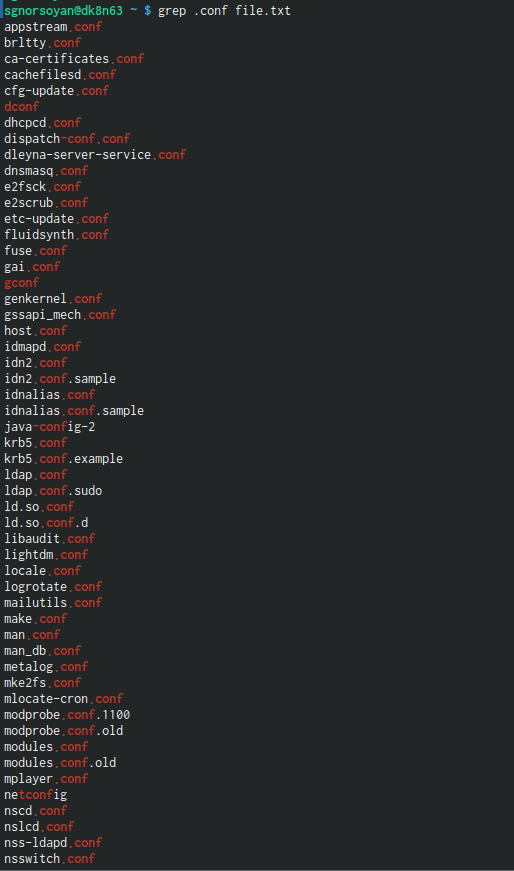{#fig:002 width=90%}

## 

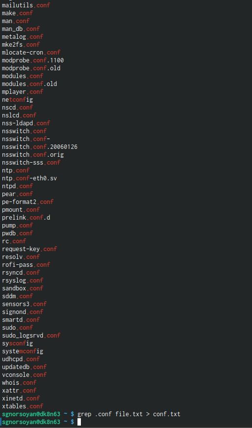{#fig:003 width=90%}

##

3. Определила, какие файлы в домашнем каталоге имеют имена, которые начинаются с символа с. Привела несколько примеров, как это сделать.

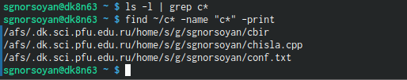{#fig:004 width=90%}

##

4. Вывела на экран имена файлов из каталога /etc, начинающиеся с символа h

{#fig:005 width=90%}

##

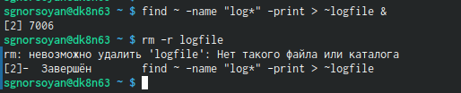{#fig:006 width=90%}

##

5. Запустила в фоновом режиме процесс, который будет записывать в файл ~/logfile файлы, имена которых начинаются с log. 

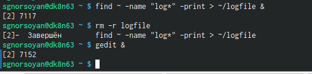{#fig:007 width=90%}

##

6. Запустила из консоли в фоновом режиме редактор gedit. 

{#fig:007 width=90%}

##

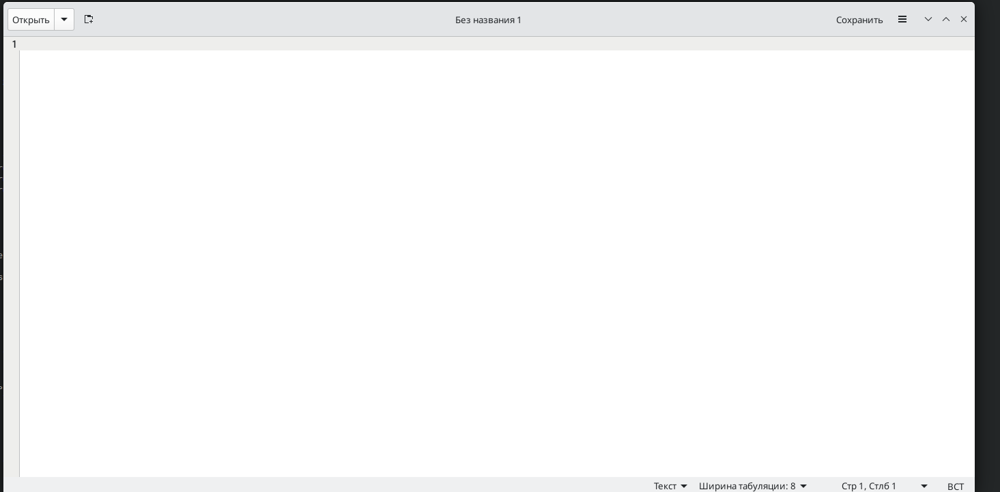{#fig:008 width=90%}

##

7. Определила идентификатор процесса gedit Используя команду ps, конвейер и фильтр grep. Более простым способом определить этот идентификатор не
получилось.

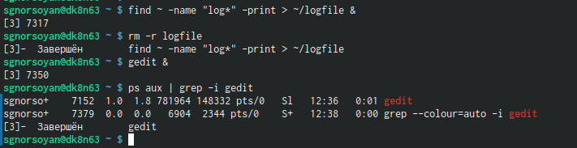{#fig:009 width=90%}

##

8. Прочла справку (man) команды kill, после чего использовал её для завершения процесса gedit.

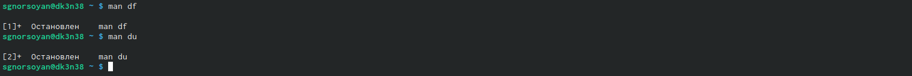{#fig:010 width=90%}

##

{#fig:009 width=90%}

##

9. Выполнила команды df и du Предварительно получив более подробную информацию об этих командах, с помощью команды man.

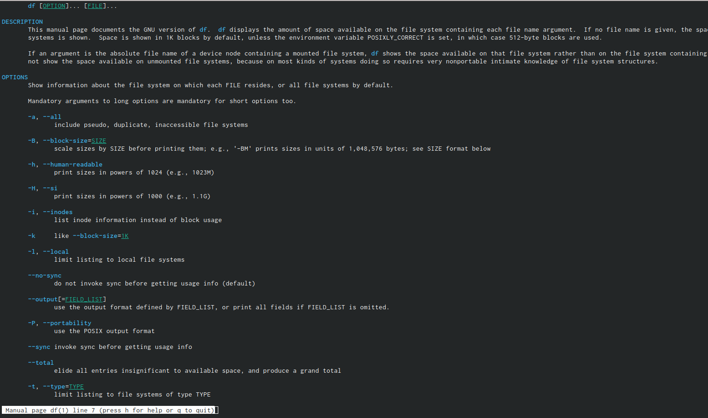{#fig:011 width=90%}

##

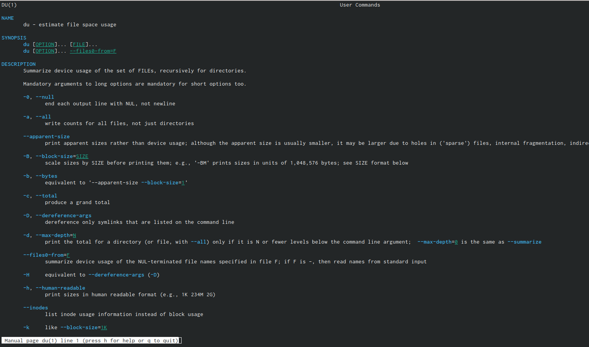{#fig:012 width=90%}

##

10. Воспользовавшись справкой команды find, вывела имена всех директорий, имеющихся в домашнем каталоге.

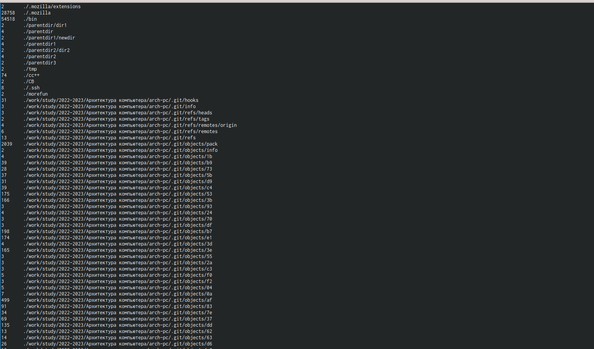{#fig:013 width=90%}

##

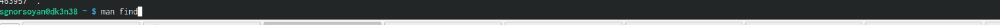{#fig:014 width=90%}

##

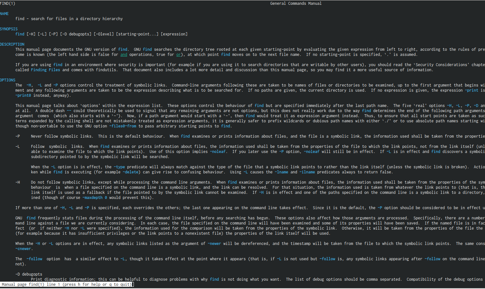{#fig:015 width=90%}

##

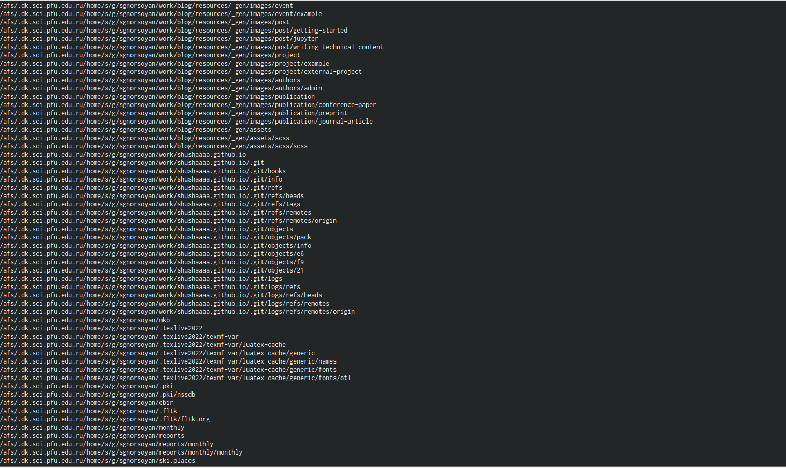{#fig:016 width=90%}

## Результаты

Ознакомилась с инструментами поиска файлов и фильтрацией текстовых данных, приобрела практические навыки, как по управлению процессами, так и по
проверке использования диска и обслуживанию файловых систем.

