---
## Front matter
title: "Лабораторная работа 6"
subtitle: "Арифметические
операции в NASM"
author: "Норсоян Шушаник Гагиковна"

## Generic otions
lang: ru-RU
toc-title: "Содержание"

## Bibliography
bibliography: bib/cite.bib
csl: pandoc/csl/gost-r-7-0-5-2008-numeric.csl

## Pdf output format
toc: true # Table of contents
toc-depth: 2
lof: true # List of figures
lot: true # List of tables
fontsize: 12pt
linestretch: 1.5
papersize: a4
documentclass: scrreprt
## I18n polyglossia
polyglossia-lang:
  name: russian
  options:
	- spelling=modern
	- babelshorthands=true
polyglossia-otherlangs:
  name: english
## I18n babel
babel-lang: russian
babel-otherlangs: english
## Fonts
mainfont: PT Serif
romanfont: PT Serif
sansfont: PT Sans
monofont: PT Mono
mainfontoptions: Ligatures=TeX
romanfontoptions: Ligatures=TeX
sansfontoptions: Ligatures=TeX,Scale=MatchLowercase
monofontoptions: Scale=MatchLowercase,Scale=0.9
## Biblatex
biblatex: true
biblio-style: "gost-numeric"
biblatexoptions:
  - parentracker=true
  - backend=biber
  - hyperref=auto
  - language=auto
  - autolang=other*
  - citestyle=gost-numeric
## Pandoc-crossref LaTeX customization
figureTitle: "Рис."
tableTitle: "Таблица"
listingTitle: "Листинг"
lofTitle: "Список иллюстраций"
lotTitle: "Список таблиц"
lolTitle: "Листинги"
## Misc options
indent: true
header-includes:
  - \usepackage{indentfirst}
  - \usepackage{float} # keep figures where there are in the text
  - \floatplacement{figure}{H} # keep figures where there are in the text
---

# Цель работы

Освоение арифметических инструкций языка ассемблера NASM

# Задание

1. Осуществите вход в систему,используя соответствующее имя пользователя.

2. Запишите в файл file.txt названия файлов,содержащихся в каталоге /etc.Допишите в этот же файл названия файлов,содержащихся в вашем домашнем каталоге.

3. Выведите имена всех файлов из file.txt,имеющих расширение .conf,после чего запишите их в новыйтекстовой файл conf.txt.

4. Определите,какие файлы в вашем домашнем каталоге имеют имена,начинавшиеся с символа c? Предложите несколько вариантов,как это сделать.

5. Выведите на экран (по странично) имена файлов из каталога /etc,начинающиеся с символа h.

6. Запустите в фоновом режиме процесс,который будетзаписывать в файл ~/logfile файлы,имена которых начинаются с log.

7. Удалите файл ~/logfile.

8. Запустите из консоли в фоновом режиме редактор gedit.

9. Определите идентификатор процесса gedit,используя команду ps,конвейерифильтр grep.Как ещё можно определить идентификатор процесса?

10. Прочтите справку (man) команды kill, после чего используйте её для завершения процесса gedit.

11. Выполните команды df и du,предварительно получив более подробную информацию об этих командах,с помощью команды man.

12. Воспользовавшись справкой команды find,выведите имена всех директорий,имеющихся в вашем домашнем каталоге.

# Теоретическое введение

Здесь описываются теоретические аспекты, связанные с выполнением работы.

Например, в табл. @tbl:std-dir приведено краткое описание стандартных каталогов Unix.

: Описание некоторых каталогов файловой системы GNU Linux {#tbl:std-dir}

| Имя каталога | Описание каталога                                                                                                          |
|--------------|----------------------------------------------------------------------------------------------------------------------------|
| `/`          | Корневая директория, содержащая всю файловую                                                                               |
| `/bin `      | Основные системные утилиты, необходимые как в однопользовательском режиме, так и при обычной работе всем пользователям     |
| `/etc`       | Общесистемные конфигурационные файлы и файлы конфигурации установленных программ                                           |
| `/home`      | Содержит домашние директории пользователей, которые, в свою очередь, содержат персональные настройки и данные пользователя |
| `/media`     | Точки монтирования для сменных носителей                                                                                   |
| `/root`      | Домашняя директория пользователя  `root`                                                                                   |
| `/tmp`       | Временные файлы                                                                                                            |
| `/usr`       | Вторичная иерархия для данных пользователя                                                                                 |

Более подробно об Unix см. в [@gnu-doc:bash;@newham:2005:bash;@zarrelli:2017:bash;@robbins:2013:bash;@tannenbaum:arch-pc:ru;@tannenbaum:modern-os:ru].

# Выполнение лабораторной работы

1. Вошла в систему, используя свой пароль. Записываю в файл file.txt названия файлов, содержащихся в каталоге /etc. Дописываю в этот же файл названия файлов, содержащихся в домашнем каталоге.

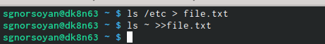{#fig:001 width=90%}

2. Вывожу имена всех файлов из file.txt, имеющих расширение .conf, после чего записалf их в новых текстовый файл conf.txt 

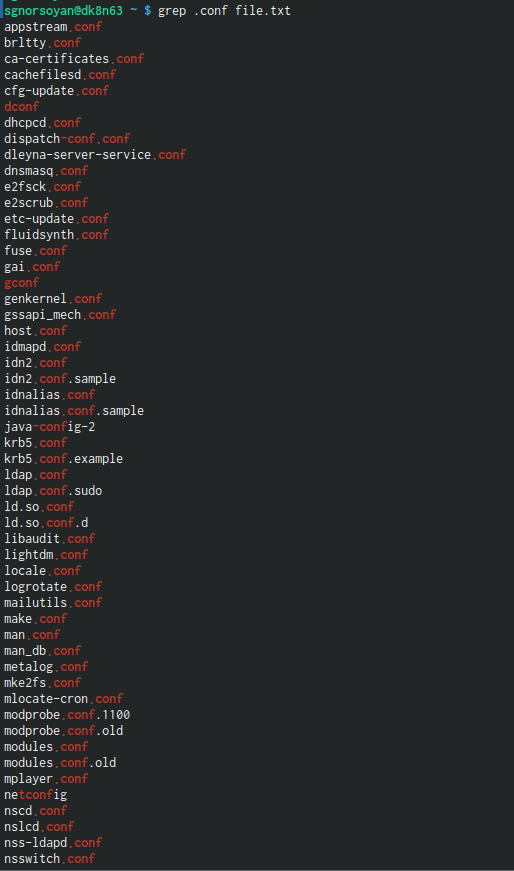{#fig:002 width=90%}

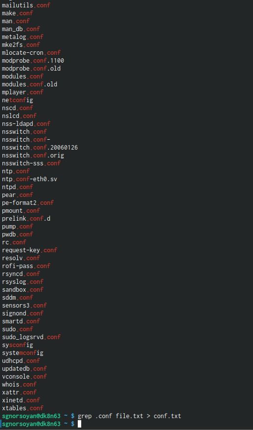{#fig:003 width=90%}

3. Определила, какие файлы в домашнем каталоге имеют имена, которые начинаются с символа с. Привела несколько примеров, как это сделать.

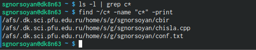{#fig:004 width=90%}

4. Вывела на экран имена файлов из каталога /etc, начинающиеся с символа h

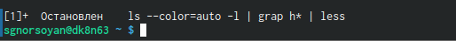{#fig:005 width=90%}

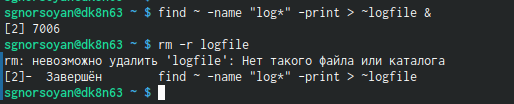{#fig:006 width=90%}

5. Запустила в фоновом режиме процесс, который будет записывать в файл ~/logfile файлы, имена которых начинаются с log. 

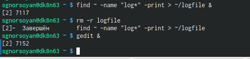{#fig:007 width=90%}

6. Запустила из консоли в фоновом режиме редактор gedit. 

{#fig:007 width=90%}

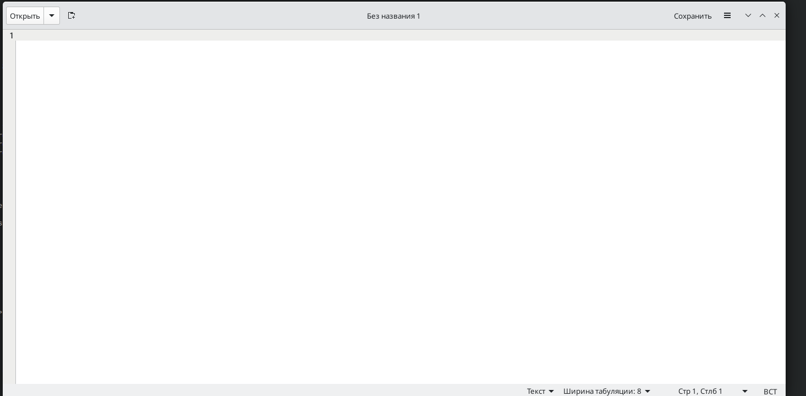{#fig:008 width=90%}

7. Определила идентификатор процесса gedit Используя команду ps, конвейер и фильтр grep. Более простым способом определить этот идентификатор не
получилось.

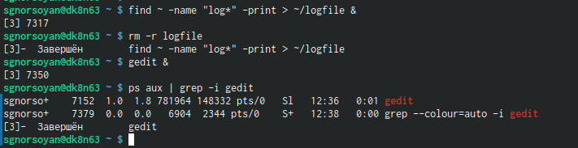{#fig:009 width=90%}

8. Прочла справку (man) команды kill, после чего использовал её для завершения процесса gedit.

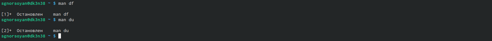{#fig:010 width=90%}

9. Выполнила команды df и du Предварительно получив более подробную информацию об этих командах, с помощью команды man.

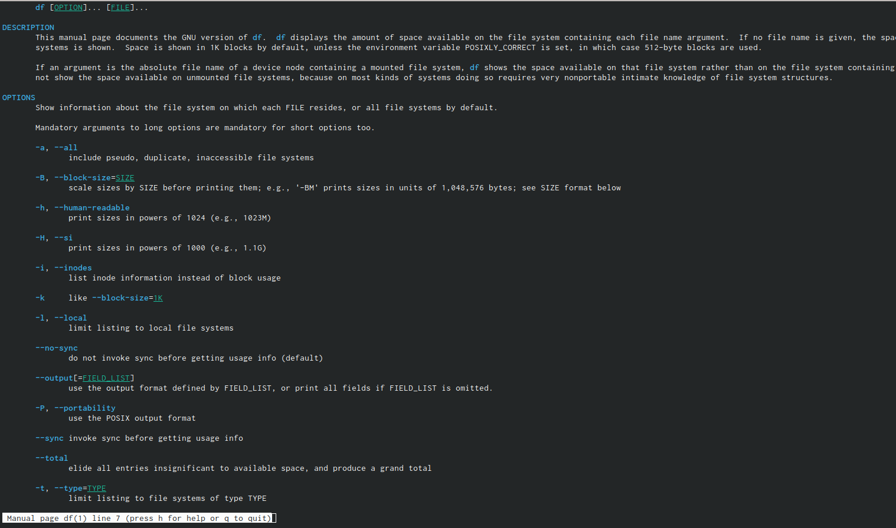{#fig:011 width=90%}

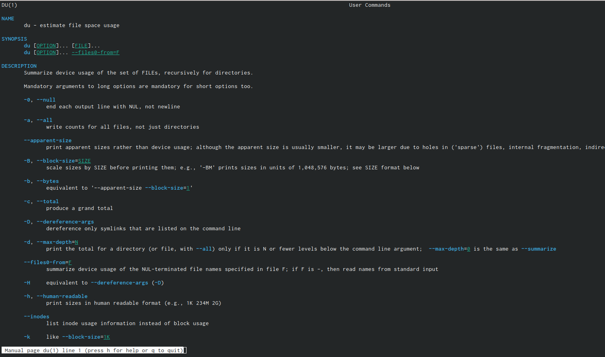{#fig:012 width=90%}

10. Воспользовавшись справкой команды find, вывела имена всех директорий, имеющихся в домашнем каталоге.

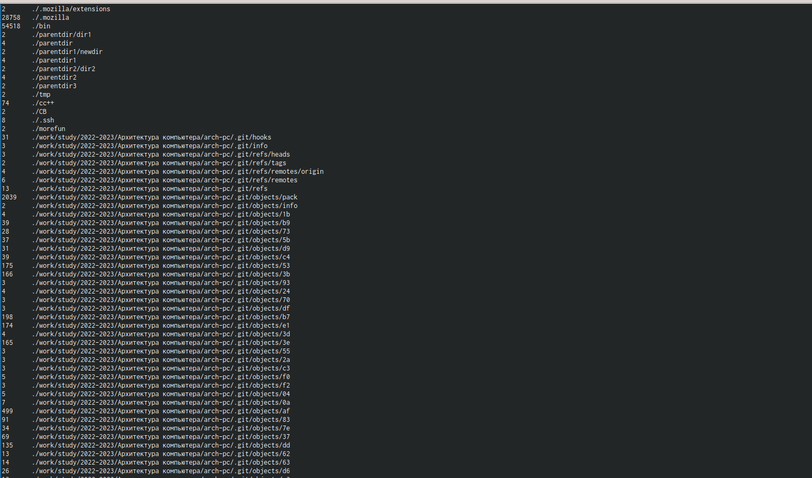{#fig:013 width=90%}

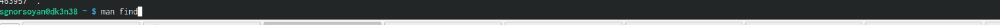{#fig:014 width=90%}

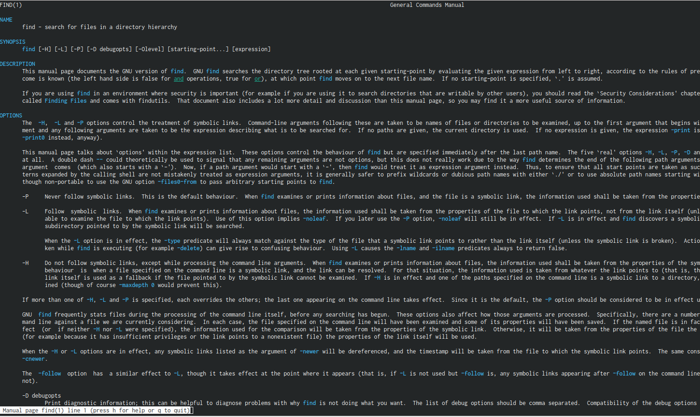{#fig:015 width=90%}

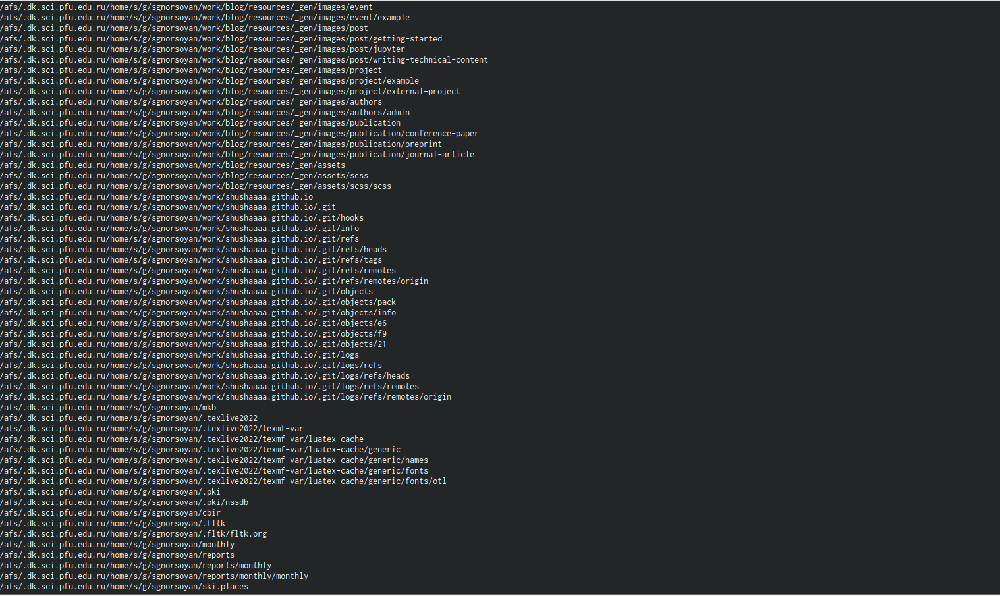{#fig:016 width=90%}

# Выводы

Ознакомилась с инструментами поиска файлов и фильтрацией текстовых данных, приобрела практические навыки, как по управлению процессами, так и по
проверке использования диска и обслуживанию файловых систем.

#Контрольные вопросы

1. Какие потоки ввода вывода вы знаете?
2. Объясните разницу между операцией > и ».
3. Чтотакое конвейер?
4. Чтотакое процесс? Чем это понятие отличается от программы?
5. Чтот акое PID и GID?
6. Чтотакое задачи и какая команда позволяет ими управлять?
7. Найдите информацию об утилитах top и htop.Каковы их функции?
8. Назовите и дайте характеристику команде поиска файлов.Приведите при-
меры ис- пользования этой команды.
9. Можно ли по контексту (содержанию) найти файл? Если да,то как?
10. Как определить объем свободной памяти на жёстком диске?
11. Как определить объем вашего домашнего каталога?
12. Как удалить зависший процесс?

#Ответы на вопросы

1. В системе по умолчанию открыто три специальных потока: – stdin — стан-
дартный поток ввода (по умолчанию: клавиатура), файловый дескриптор 0;
– stdout — стандартный поток вывода (по умолчанию: консоль), файловый
дескриптор 1; – stderr — стандартный поток вывод сообщений об ошибках
(по умолчанию: консоль), файловый дескриптор 2.
2. • перенаправление stdout (вывода) в файл. Если файл отсутство-
вал, то он создаётся, иначе - перезаписывается.
• перенаправление stdout (вывода) в файл. Если файл от-
сутствовал, то он создаётся, иначе - добавляется.
3. Конвейер (pipe) служит для объединения простых команд или утилит в
цепочки, в которых результат работы предыдущей команды передаётся
последующей.
4. Процесс это - совокупность программного кода и данных, загруженных
в память ЭВМ. Любой команде, выполняемой в системе, присваивается
идентификатор процесса (process ID). Получить информацию о процессе и
управлять им, пользуясь идентификатором процесса, можно из любого окна
командного интерпретатора. Процессом называют выполняющуюся про-
грамму и все её элементы: адресное пространство, глобальные переменные,
регистры, стек, открытые файлы и так далее.
5. PID — уникальный номер (идентификатор) процесса в многозадачной ОС.
GID – идентификатор группы.
18
6. Любую выполняющуюся в консоли команду или внешнюю программу мож-
но запустить в фоновом режиме. Запущенные фоном программы называют-
ся задачами (jobs). Ими можно управлять с помощью команды jobs, которая
выводит список запущенных в данный момент задач. Для завершения за-
дачи необходимо выполнить команду kill %номер задачи.
7. Команда top в Linux системах позволяет вывести в виде таблицы перечень
запущенных процессов и оценить, какой объем ресурсов они потребляют,
т.е., какую нагрузку создают на сервер и дисковую подсистему. Команда htop
— продвинутый монитор процессов, показывает динамический список си-
стемных процессов, список обычно выравнивается по использованию ЦПУ.
В отличие от top, htop показывает все процессы в системе. Также показыва-
ет время непрерывной работы, использование процессоров и памяти. htop
часто применяется в тех случаях, когда информации даваемой утилитой
top недостаточно, например при поиске утечек памяти в процессах.
8. Команда find используется для поиска и отображения имён файлов, соответ-
ствующих заданной строке символов. Формат команды: find путь [-опции]
Путь определяет каталог, начиная с которого по всем подкаталогам будет
вестись поиск. Примеры:
• вывести на экран имена файлов из вашего домашнего каталога и его подка-
талогов, начинающихся на f: find ~ -name “f*” -print
• вывести на экран имена файлов в каталоге /etc, начинающихся с символа p:
find /etc -name “p*” -print
• найти в вашем домашнем каталоге файлы, имена которых заканчиваются
символом и удалить их: find ~ -name “*~” -exec rm “{}” ;
9. Найти файл по контексту (содержанию) позволяет команда grep. Формат
команды: grep строка имя_файла Примеры:
• показать строки во всех файлах в вашем домашнем каталоге с именами,
начинающимися на f, в которых есть слово begin: grep begin f*
19
• найти в текущем каталоге все файлы, в имени которых есть буквосочетание
«лаб»: ls -l | grep лаб
10. Определить объем свободной памяти на жёстком диске позволяет команда
df.
11. Определить объем домашнего каталога позволяет команда df /home/
12. Удалить зависший процесс можно командой kill %номер задачи

# Список литературы{.unnumbered}

::: {#refs}
:::
